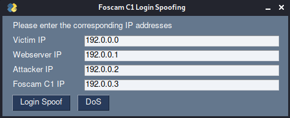

# Foscam Vulnerability Exploit

# Introduction
The use of security cameras in private homes is gradually increasing. A significant factor in this growth is the popularity of Internet Protocol (IP) cameras. Unfortunately, the Internet of Things (IoT), which IP cameras are a part of, is known for its vulnerabilities. Using the Foscam C1 IP camera as a representative of this category, we demonstrate the weaknesses of IP cameras. This applet will exploit the Address Resolution Protocol (ARP), and leverage its weaknesses to establish a Man in The Middle (MiTM) position, from which we can perform Denial of Service (DoS) attacks and login spoofing.

# Attack Setup
The requirements for executing the attack are twofold,
1. The attacking machine and the Foscam C1 camera must be part of the same physical network, and
2. The IP addresses of the attacking machine, the victim machine, the proxy server and the Foscam C1 must be known.
To achieve these goals, external software such as Nmap may be used.

Moreover, an external web server must be launched. More information can be found in section **Web Server** at the bottom of this page. 

The applet also relies on the functionality of two Python modules, *mitmproxy* and *PySimpleGUI*. These must be installed prior to executing the attack.

# Executing Attack
To execute the attack, one must run the `main.py` file with root privilages. As a result of the use of shellcode, it is recommended to run the attack in an IDE, such as PyCharm, whilst logged into the Root account. Note that all files must be in the same folder for the applet to launch.  
When `main.py` has started running, the applet build using *PySimpleGUI* will appear. From this screen one must enter the required IP addresses. Next, the login spoof can be launched by pressing the button labeled *login Spoof*. The Denial of Service can be launched by pressing the button labeled *DoS*.  
The User Interface is shown in the image below.  

Depending on the downloaded version of *mitmproxy*, `executeProxy.sh` might need to be changed to  
`sudo mitmdump -s request.py --mode transparent --ignore :443$ --listen-host $1`  
as opposed to  
`sudo mitmdump -s request.py --mode transparent --ignore-hosts :443$ --listen-host $1`  
The version of `executeProxy.sh` found in this repository is correct when using the current version of *mitmproxy* (_v6.0.2_) at the time of writing. 

To stop the attack, the applet can be closed by either pressing `ctrl+c`, clicking the stop button in the toolbar or pressing `ctrl+F2`.

# Web Server
We recommend using an Apache2 server on Ubuntu to run the webserver, since it is easy to use and only needs a few commands to get up and running.
First download Apache2 on your machine by executing the following code in the terminal  
`sudo apt-get install apache2`  
or if already installed  
`sudo apt-get upgrade apache2`  

Secondly, we need to change the port configuration. Hence we run the following command  
`sudo nano /etc/apache2/ports.conf`  
Under the line `Listen 80` add a new line and type `Listen 88`. Exit and save this config file.  

Thirdly, we need to add the `index.html` file and all images to the right directory for the server to read it.  
Execute the commands  
`cd /var/www/html` 
`sudo mkdir images` 
Next, open your terminal and navigate to the directory where you stored the `index.html` file and images folder. 
Once in the correct directory execute the following commands  
`sudo mv index.html /var/www/html` 
`cd images` 
`sudo mv * /var/www/html/images` 

Now that we have everything set up in a correct manner, we can start the server by running the command  
`sudo systemctl start apache2.service`  

To test if the server is working correctly, enter the IP address of the webserver on any other machine on the Local Area Network and check that it shows the fake login page.

# Report
The report on this vulnerability can be found in the `report.pdf` file
